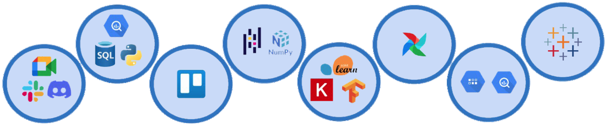
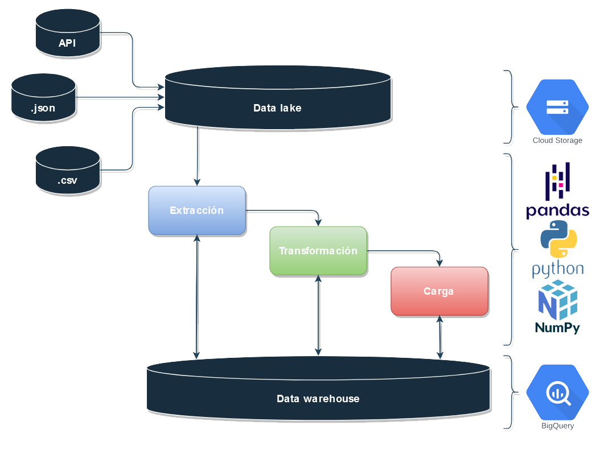
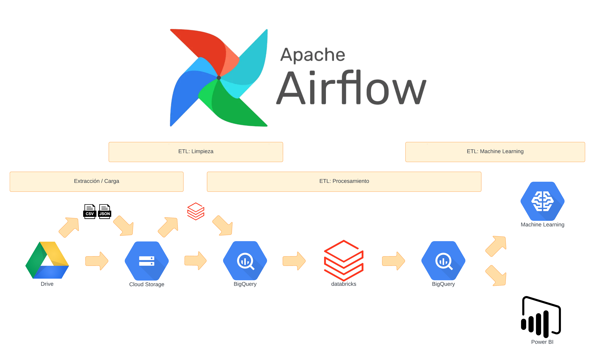
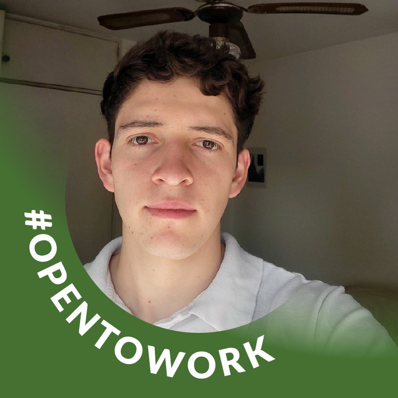
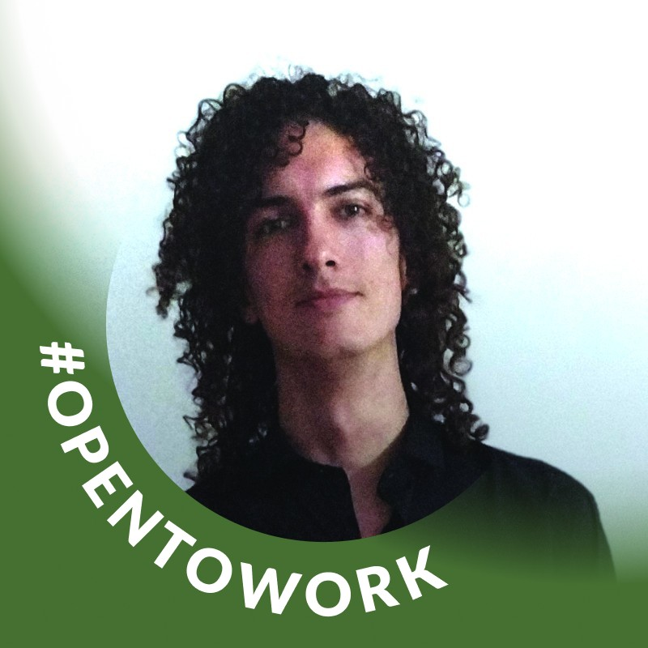
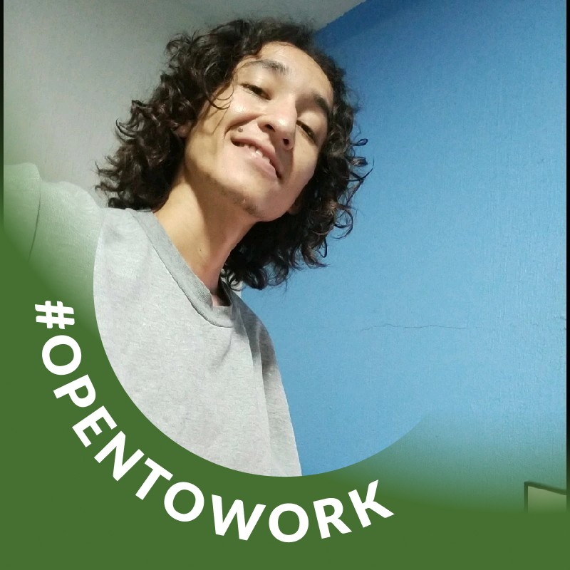

<h1>
PROYECTO FINAL DPT-04
 

 YELP & GOOGLE MAPS 
</h1>

En el contexto de este proyecto, nos identificamos como parte integral de una consultora especializada en el análisis de datos y estrategias empresariales. Nuestro enfoque se centra en la exploración profunda de información, fusionando el análisis de datos con la comprensión del negocio. Este enfoque combinado nos permite fijar metas realistas y alcanzar los objetivos acordados de manera efectiva.

En **sinergia global**, nuestra labor no se limita únicamente al análisis de datos. También nos comprometemos a ofrecer capacitaciones y asesoramiento personalizado, con el propósito de que nuestros clientes puedan visualizar los datos desde nuevas perspectivas y, a partir de estos, tomar decisiones estratégicas.

Nuestra principal misión es ayudar a nuestros clientes para que extraigan el valor máximo de sus datos y posean las herramientas necesarias para la toma de decisiones empresariales informadas y efectivas.

## 📄 CONTEXTO:
En esta ocasión, hemos sido seleccionados por CulinaryCrossRoads, una empresa que gestiona varios establecimientos gastronómicos en el estado de Indiana. Su objetivo es expandir su presencia a otros estados, y nos han confiado el análisis del mercado estadounidense actual. Nuestra tarea principal consiste en proporcionar información valiosa basada en un análisis profundo de datos para respaldar decisiones estratégicas que minimicen los riesgos y maximicen las oportunidades de crecimiento para la empresa.

Los **`objetivos`** específicos a alcanzar son los siguientes:

- Identificar oportunidades para nuevos negocios: Utilizando un análisis exhaustivo del mercado, evaluando tendencias y preferencias, y considerando datos poblacionales para identificar áreas estratégicas de crecimiento.

- Analizar datos de usuarios para sistemas de recomendación: Aplicando técnicas de procesamiento de lenguaje natural y segmentación de usuarios para desarrollar sistemas de recomendación personalizados.
Implementar modelos de aprendizaje automático: A través del preprocesamiento de datos, selección de variables relevantes y desarrollo de modelos predictivos evaluaremos el éxito potencial de nuevos negocios.

## 💻 TECNOLOGÍAS UTILIZADAS

En este proyecto específico, hemos decidido emplear las siguientes tecnologías y herramientas que nos permitirán realizar análisis exhaustivos, implementar modelos de aprendizaje automático y presentar resultados de manera accesible.

+ **Google Meet**, **Slack** y **Discord**: facilitando la colaboración y comunicación fluida entre los miembros del equipo.
+ **Trello**: para gestionar el proyecto y flujo de trabajo, así como supervisar las tareas.

+ **Python**: como lenguaje de programación principal para el desarrollo y la manipulación de datos.
+ **Pandas y NumPy**: para el análisis y procesamiento eficiente de datos estructurados y numéricos.
+ **Scikit-learn**: una biblioteca de aprendizaje automático en Python que proporciona herramientas para diversos algoritmos y técnicas.
+ **Keras y TensorFlow**: para el desarrollo y entrenamiento de modelos de aprendizaje profundo.

+ **Apache Airflow**: para la automatización y gestión de flujos de trabajo, permitiendo una programación eficiente de tareas y procesos.
+ **Google Cloud Storage**: para el almacenamiento seguro y escalable de datos en la nube.
+ **Google BigQuery**: como una solución de almacenamiento y análisis de datos a gran escala.
+ **Databricks**: como plataforma unificada para el procesamiento y análisis de datos a gran escala, facilitando la colaboración y ejecución de proyectos de datos complejos.
+ **Tableau**: como herramienta de visualización de datos para presentar información de manera intuitiva y comprensible.

## 🏛️ ARQUITECTURA

Comenzamos con un tratamiento inicial de los datos, detallado en los notebooks, una fase crucial para asegurar que los datos estén limpios, bien organizados y listos para su análisis. Este paso es esencial, ya que permite identificar las características más relevantes para los objetivos del proyecto. 

Simplificar el pipeline al centrarse en datos clave mejora la eficiencia y evita la inclusión de información redundante.

Luego, para la creación del pipeline, se diseñó la arquitectura de Big Data respaldada por la tecnología de Google Cloud Platform. Esto incluye la organización de datos en Cloud Storage, la automatización de tareas mediante Cloud Functions y la explotación de datos a través de BigQuery, Tableau y aplicaciones de Machine Learning. Esta estrategia proporciona una base sólida y escalable para gestionar y analizar los extensos conjuntos de datos de Yelp y Google Business.

## 📋BASE DE DATOS - DER

Este diagrama consta de dos tablas de hechos principales, denominadas 'consejos' y 'reviews', junto con otras nueve tablas de dimensiones que proporcionan contextos detallados y enriquecen la comprensión de los datos.
En el proceso de diseño, hemos incorporado identificación de entidades, atributos y relaciones, proporcionando una representación completa de la estructura de datos.
Además, hemos especificado las claves primarias (PK) para cada tabla, asegurando la unicidad y la identificación única de cada registro. También hemos definido claves foráneas (FK) para establecer relaciones coherentes entre las tablas, permitiendo referencias cruzadas.

En esta oportunidad elegimos un modelo de diagrma llamado StarFLake:

Es un esquema de copo de estrella, combina elementos de esquemas de estrella y copo de nieve. Adopta la desnormalización de jerarquías dimensionales de los esquemas de estrella y la normalización de dimensiones compartidas mediante estabilizadores, aprovechando así los beneficios de ambos en términos de eficiencia y redundancia reducida.

## 🛠️ EL EQUIPO

<table align="center">
<tr>
<td>  </td>
<td>  </td>
<td>  </td>
<!-- <td>  </td> -->
<td>  </td>
</tr>
</table>

<table align="center">
<tr> <td> 

- Edith Cuellar Bocanegra </td> <td> [LinkedIn](https://www.linkedin.com/in/edith-cuellar-84521226/)  👈👀 </td></tr>
<tr> <td> 
  
- Leandro Martín Ibarra </td> <td> [LinkedIn](https://www.linkedin.com/in/leandro-ibarra-691030270/)  👈👀</td></tr>
<tr> <td> 

- Matias Emanuel Baez </td> <td> [LinkedIn](https://www.linkedin.com/in/matias-emanuel-baez/)  👈👀</td></tr>
<tr> <td> 

<!--- Nicolas Agustín Ibarra </td> <td> [LinkedIn](https://www.linkedin.com/in/nicovid-ibarra/)  👈👀</td></tr>
<tr> <td> -->

- Tinmar Armando Andrade Banda </td> <td> [LinkedIn](https://www.linkedin.com/in/tinmar-data-engineer/)  👈👀</td></tr>

</table>

